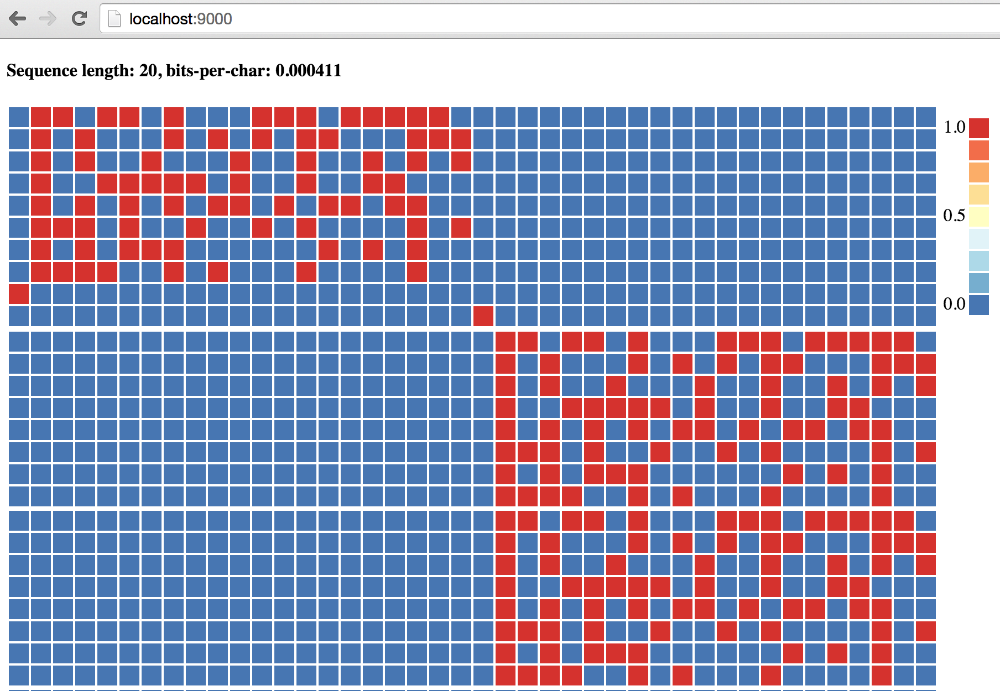
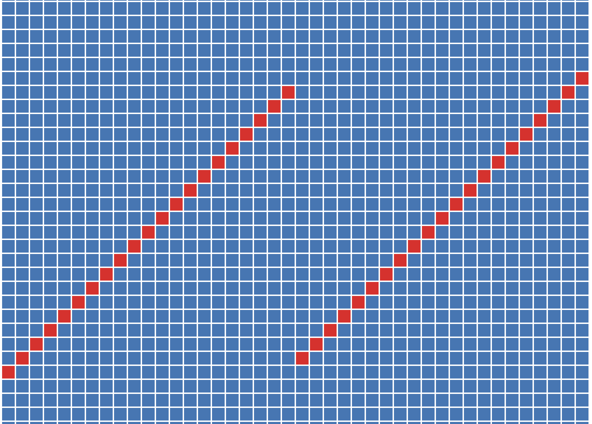
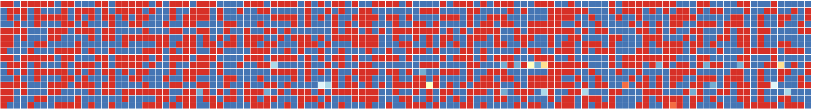
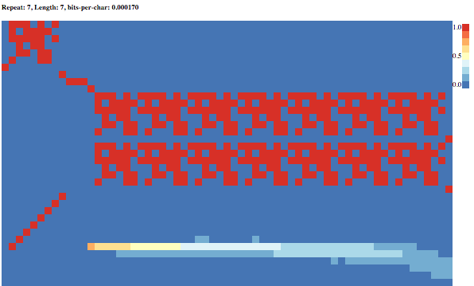
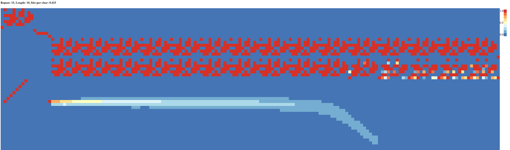
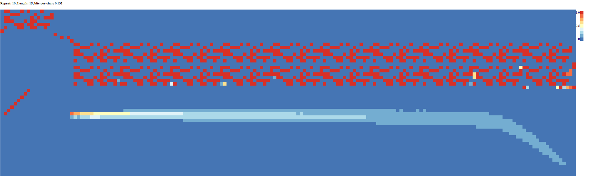
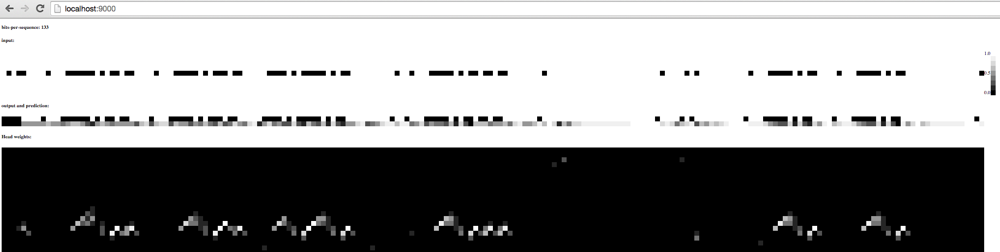

Neural Turing Machines
-----
Package ntm implements the Neural Turing Machine architecture as described in A.Graves, G. Wayne, and I. Danihelka. arXiv preprint arXiv:1410.5401, 2014.

Using this package along its subpackages, the "copy", "repeatcopy" and "ngram" tasks mentioned in the paper were verified.
For each of these tasks, the successfully trained models are saved under the filenames "seedA_B",
where A is the number indicating the seed provided to rand.Seed in the training process, and B is the iteration number in which the trained weights converged.

## Reproducing results in the paper
The following sections detail the steps of verifying the results in the paper. All commands are assumed to be run in the $GOPATH/github.com/fumin/ntm folder.

### Copy
#### Train
To start training, run `go run copytask/train/main.go` which not only commences training but also starts a web server that would be convenient to track progress.
To print debug information about the training process, run `curl http://localhost:8088/PrintDebug`.
To track the cross-entropy loss during the training process, run `curl http://localhost:8088/Loss`.
To save the trained weights to disk, run `curl http://localhost:8088/Weights > weights`.
#### Testing
To test the saved weights in the previous training step, run `go run copytask/test/main.go -weightsFile=weights`. Alternatively, you can also specify one of the successfully trained weights in the copytask/test folder such as the file `copytask/test/seed2_19000`.
Upon running the above command, a web server would be started which can be accessed at http://localhost:9000/.
Below are screenshots of the web page showing the testing results for a test case of length 20.
The first figure shows the input, output, and predictions of the NTM, and the second figure shows the addressing weights of the memory head.

The figure below shows the results for the test case of length 120. As mentioned in the paper, the NTM is able to perform pretty well in this case even though it is only trained on sequences whose length is at most 20.

### Repeat copy
To experiment on the repeat copy task, follow the steps of the copy task except changing the package from `copytask` to `repeatcopy`.

In this task, I deviated from the paper a bit in an attempt to see if we could general NTM to unseed repeat numbers. In particular, I think that the paper's way of representing the repeat number as a scalar which is normalized to [0, 1] seems a bit too artificial, and I took a different approach by encoding the repeat number as a sequence of binary inputs. The reasoning behind my approach is that by distributing the encoding through time, there would be no upper limits on the repeat number, and given NTMs relatively strong memorizing abilities, this act of distributing through time should not pose too big a problem to NTMs. In addition, I also gave the NTMs two memory heads instead of one as in the paper for these repeat copy tasks. However, in the end the NTMs still was not able to generalize well on the repeat number.

Below, I first show the results on the test case of repeat 7 and length 7. For this test case, we see the NTM is able to solve it perfectly by emitting the end signal unambiguously on the last time instant. Moreover, we see that the NTM solves it by assigning the first memory head the reponsibility of keeping count of the repeat times, and the second memory head the responsibility of replaying the input sequence.

Next, we generalize the NTM to configurations unseen in the training step. The below figure shows the results on generalizing on the repeat number to 15. We see that the NTM fails on this generalization.

The below figure shows the results on generalizing on the sequence length to 15. We see that the NTM does a fairly good job as mentioned in the paper.

### Dynamic N-grams
To experiment on the dynamic n-grams task, follow the steps of the copy task except changing the package from `copytask` to `ngram`.

The figure below shows the results of this task. We see that the bits-per-sequence loss is 133 which is close to the theoretical optimal value given by Bayesian analysis in the paper.
Moreover, by observing the fact that the memory weights for the same 5-bit prefix remains the same throughout the entire testing sequence, we verified the paper's claim that the NTM solved this task by emulating the optimal Bayesian approach of keeping track of transitional counts.

## Testing
To run the tests of this package, run `go test -test.v`.
